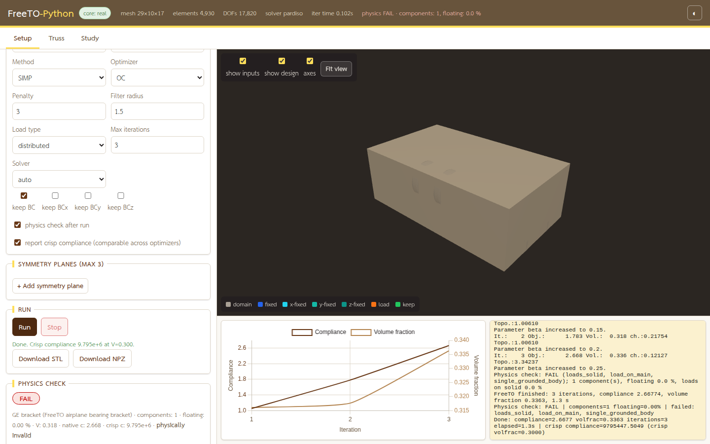

# FreeTO-Python

A Python port of FreeTO (O. Ibhadode, Y.-F. Fu, A. Qureshi, "FreeTO - Freeform 3D topology optimization
using a structured mesh with smooth boundaries in Matlab", *Advances in Engineering Software* 198 (2024) 103790,
doi:[10.1016/j.advengsoft.2024.103790](https://doi.org/10.1016/j.advengsoft.2024.103790)), extended with a
QUBO design update that can be solved by exact enumeration, simulated annealing, tabu search, greedy descent or
simulated QAOA, plus a local web app for driving it.



Developed by Nitipong Praphaphankul, Architectural Intelligence (A.I.) Research Group, Faculty of Architecture,
Chulalongkorn University. The QUBO method and its benchmark against MMA are described in the manuscript
"QUBO design updates for freeform 3D topology optimisation: a quantum-annealing-compatible formulation
benchmarked against MMA" (submitted to *Engineering Structures*); see `docs/NOTES_quantum.md` and
`docs/QUANTUM_API.md`.

See `docs/CONTRACT.md` for the shared interface between the numerical core and the web app.

## Quick start

The fastest way to use FreeTO-Python is the web app: install Python once, then double-click
a launcher. It creates its own environment the first time and reuses it after that - you
never need to open a terminal.

### Windows

1. Install **Python 3.12** from <https://www.python.org/downloads/windows/>. On the first
   install-wizard screen, tick **"Install launcher for all users"** (this gives you the `py`
   command the launcher uses); ticking **"Add python.exe to PATH"** is optional and not needed.
2. Double-click **`Start FreeTO (Windows).bat`**.
3. **First run only:** Windows SmartScreen may show "Windows protected your PC" because the
   file has no publisher signature. Click **More info**, then **Run anyway**. (This is a
   one-time warning for any downloaded/emailed `.bat` file, not specific to this app.)
4. The first launch downloads and installs everything it needs (a couple of minutes,
   including a ~200 MB download for the optional fast MKL/PARDISO solver); every launch after
   that starts in a few seconds and works fully offline.

### macOS

1. Install **Python 3.12** from <https://www.python.org/downloads/macos/> (or, with
   Homebrew, `brew install python@3.12`).
2. Double-click **`Start FreeTO (macOS).command`**.
3. **First run only:** macOS will likely refuse to open it ("cannot be opened because it is
   from an unidentified developer"). On macOS 15 (Sequoia) and newer, Control-click no longer
   bypasses this - instead go to **System Settings → Privacy & Security**, scroll down to the
   blocked-app notice, and click **Open Anyway** (you'll be asked once more to confirm). On
   older macOS, Control-click (or right-click) the file → **Open** → **Open** in the dialog.
   Either way this is only needed once. Alternatively, from a terminal in this folder:
   `chmod +x "Start FreeTO (macOS).command" && xattr -dr com.apple.quarantine .`
4. The first launch installs dependencies (a minute or two); later launches are instant and
   work offline.

### Where things live, and resetting

Both launchers create a virtual environment **outside** this project folder - this folder
may be a long, spaced, cloud-synced Documents path, which is a bad place for a Python
environment (large binary files, sync tools that can evict or re-upload it):

| Platform | Default location | Override |
|---|---|---|
| Windows | `%LOCALAPPDATA%\FreeTO-Python\venv` | set `FREETO_VENV` |
| macOS | `~/Library/Application Support/FreeTO-Python/venv` | set `FREETO_VENV` |
| Linux | `${XDG_DATA_HOME:-~/.local/share}/FreeTO-Python/venv` | set `FREETO_VENV` |

To reset it (e.g. after a Python upgrade, or if something looks broken), just delete that
folder and run the launcher again - nothing outside it is touched. Uploads and job results
are separate; see `FREETO_WEBAPP_DIR` further down.

### Optional speedups

* **macOS only** - CHOLMOD (what MATLAB's backslash uses, and the fastest direct solver
  available on Apple Silicon): `brew install suite-sparse`, then, using the venv above,
  `"$HOME/Library/Application Support/FreeTO-Python/venv/bin/python" -m pip install scikit-sparse`.
* **Windows/Linux x86-64** - the Intel MKL PARDISO direct solver (`pypardiso`) is already
  installed automatically by `requirements.txt`; no extra step needed.

### Prefer a terminal?

The launchers above are equivalent to:

```bash
# Windows (Command Prompt)
py -3.12 -m venv "%LOCALAPPDATA%\FreeTO-Python\venv"
"%LOCALAPPDATA%\FreeTO-Python\venv\Scripts\python.exe" -m pip install -r requirements.txt
"%LOCALAPPDATA%\FreeTO-Python\venv\Scripts\python.exe" -m webapp.server --port 8000 --open

# macOS
python3.12 -m venv "$HOME/Library/Application Support/FreeTO-Python/venv"
"$HOME/Library/Application Support/FreeTO-Python/venv/bin/python" -m pip install -r requirements.txt
"$HOME/Library/Application Support/FreeTO-Python/venv/bin/python" -m webapp.server --port 8000 --open

# Linux
python3.12 -m venv "${XDG_DATA_HOME:-$HOME/.local/share}/FreeTO-Python/venv"
"${XDG_DATA_HOME:-$HOME/.local/share}/FreeTO-Python/venv/bin/python" -m pip install -r requirements.txt
"${XDG_DATA_HOME:-$HOME/.local/share}/FreeTO-Python/venv/bin/python" -m webapp.server --port 8000 --open
```

(run each block from this `freeto_py` folder). Or use any virtual environment you like,
anywhere - `.venv` inside the project works fine for command-line/development use; the
launchers just default to a location outside it for double-click users. See "Core → Install"
below for the plain library/CLI setup.

## Core

The numerical core lives in `freeto/` (pure Python: numpy, scipy, scikit-image, pyamg).
It is a faithful port of the MATLAB FreeTO code (Ibhadode et al., *Advances in Engineering
Software*, 2024, <https://doi.org/10.1016/j.advengsoft.2024.103758>): same grid construction,
same SIMP / SEMDOT loops with smooth-edge (Heaviside) post-processing, same optimality-criteria
update, same filters and load/support semantics.  It reproduces Octave runs of the original code
to ~1e-12 (see "Verification" below).

### Install

Use a virtual environment (Python 3.10+):

```bash
cd freeto_py
python3 -m venv .venv
source .venv/bin/activate            # Windows: .venv\Scripts\activate
pip install -r requirements.txt      # core only: pip install numpy scipy scikit-image pyamg
```

Optional faster direct solvers (picked automatically by `solver="auto"` when importable):

* `pypardiso` - Intel MKL PARDISO (x86-64 Windows/Linux only; there is no `mkl` wheel for
  macOS at all, Apple Silicon or Intel)
* `scikit-sparse` - CHOLMOD, what MATLAB's backslash uses.  On macOS:
  `brew install suite-sparse && pip install scikit-sparse`

Without them (e.g. a pip-only install on an M1/M2 Mac) `auto` uses SuperLU for small problems
(< 10k free DOFs) and pyamg smoothed-aggregation preconditioned CG otherwise. Above
`freeto.fe.DIRECT_SOLVER_DOF_CAP` (1.5M free DOFs) `auto` prefers pyamg over a direct
factorization even when CHOLMOD/PARDISO are installed, since a direct solve at that size can
need tens of GB of RAM; pass an explicit `solver=` to override this.

### Command line

Run from the `freeto_py/` directory (or put it on `PYTHONPATH`):

```bash
# a README example at a coarser mesh (MeshControl 40), write the optimised STL
python -m freeto.cli --example GE_bracket --mesh 40 --out ge.stl
python -m freeto.cli --list-examples

# fully manual (MATLAB name-value names are accepted as aliases)
python -m freeto.cli --domain examples/STLs/GE_domain.STL \
    --force1 examples/STLs/GE_force.STL --force2 examples/STLs/GE_force.STL \
    --fixed examples/STLs/GE_fixed.STL --mesh 80 --volfrac 0.3 \
    --Fmagy 0 -2000 --Fmagz 1500 0 --YoungsModulus 210e9 \
    --optimization SIMP --out ge.stl --npz ge.npz

# symmetry: --symmetry PLANE[:DIRECTION] (x-y | y-z | z-x, left | right), up to 3 times
python -m freeto.cli --example quadcopter --mesh 50 --out quad.stl
```

Other flags: `--xfixed/--yfixed/--zfixed/--keepdom`, `--keep-bc/--keep-bcx/y/z yes|no`,
`--method SIMP|SEMDOT`, `--optimizer OC|MMA`, `--penal`, `--rmin`, `--nu`, `--loadtype
distributed|point`, `--max-iter`, `--solver auto|cholmod|pardiso|superlu|amg`, `--tolx`,
`--tol-thresh`, `--beta-init`, `--beta-step`, `--no-smooth`.  Ctrl-C stops cleanly after the
current iteration and still writes the result.

### Python API

```python
from freeto import FreeTOConfig, run_freeto, example_config

cfg = FreeTOConfig(
    domain="examples/STLs/GE_domain.STL",
    forces=["examples/STLs/GE_force.STL", "examples/STLs/GE_force.STL"],   # load cases 1, 2
    fixed="examples/STLs/GE_fixed.STL",
    mesh_control=60, volfrac=0.3,
    fmagy=[0, -2000], fmagz=[1500, 0], youngs_modulus=210e9,
)
res = run_freeto(cfg, callback=lambda info: None, log=print)
print(res.comp, res.finalvol, res.iterations)
verts, faces = res.surface()          # closed, capped surface in the STL's own coordinates (mm)
res.write_stl("ge.stl")
res.save_npz("ge.npz")

cfg = example_config("air_bracket", mesh_control=50)   # README examples with absolute paths
```

`run_freeto` calls `callback` once with `{"stage": "setup", ...}` and then once per iteration with
`{"stage": "iter", "iter", "compliance", "volfrac", "change", "topo", "beta", "elapsed",
"iter_time", "field"}`; `field.top` is the level-set φ = xg − ls (solid where φ > 0) in (x, y, z)
axis order with `field.origin` / `field.spacing` in mm.  `stop_event` (a `threading.Event`) ends the
run after the current iteration (`res.stopped = True`).  See `docs/CONTRACT.md` for the full interface.

Extra `FreeTOConfig` fields beyond the MATLAB inputs: `tolx`, `tol_thresh`, `beta_init`,
`beta_step`, `beta_max` (default: MATLAB values; with `optimizer="MMA"` the README's
recommendation tolx = tol_thresh = 1e-3, beta = ER = 0.5, uncapped), `mma_move`,
`inside_mode` (`"robust"` default / `"matlab"`), `compat` (`"matlab"` / `"octave"`
linspace/colon arithmetic), `amg_rtol` (1e-8).

### Differences from the MATLAB code

* The output STL is in the **original physical coordinates** of the input domain (mm), with the
  true element size; MATLAB's `stlgen` shifts the design to the origin and rescales it by
  `max(del)/max(nel)`.  Symmetry copies are placed next to the original half (mirror plane at the
  grid boundary + h/8, as implied by symmetry.m's duplicated boundary slice).
* MMA is an independent implementation of Svanberg's MMA (the original expects the user to obtain
  `mmasub.m`); it is wired in exactly where the commented-out lines of SIMP.m/SEMDOT.m are.
* The inside test replaces `intriangulation.m` with grid ray casting.  `inside_mode="matlab"`
  reproduces intriangulation bit-for-bit; the default `"robust"` mode additionally counts rays
  that pass exactly through a facet edge/vertex correctly (intriangulation misses rays through
  non-axis-parallel shared edges).  Both give identical grids for all example STLs.
* Input checking is stricter and clearer (e.g. empty force regions, inconsistent load-case
  counts, flat/empty STLs, grids above `max_dofs` = 3 M DOFs, `mesh_control` >= 4, supports that
  do not restrain all rigid-body motions → `FreeTOError` with a readable message instead of a
  solver crash); the "at least one non-zero load" check is implemented as intended (the MATLAB
  test `all([Fmagx Fmagy Fmagz])` rejects loads whose components are all non-zero).

### Things to know

* **Units**: STL coordinates are read and written in **mm**; forces in N, Young's modulus in Pa,
  compliance in N·m.
* **Symmetry mirror planes** sit at the last grid plane + h/8 (h = element size), and the grid
  (inherited from MATLAB's geomeshini) can end up to ~h/2 inside the domain's bounding-box face on
  the axes that do not get `MeshControl` points.  A mirrored design can therefore be up to ~h
  shorter than twice the half-domain (e.g. 34.4 mm instead of 38.1 mm for the air bracket at
  MeshControl 40).  Use a finer mesh if this matters.
* **OC designs stay grey**: with the default optimizer (OC, faithful to FreeTO) the Heaviside
  sharpness beta is capped at 2, so element densities remain intermediate and the reported
  compliance includes the SIMP penalisation.  `optimizer="MMA"` uses the FreeTO README's MMA
  settings (beta grows by 0.5 per iteration) and gives much crisper, stiffer designs
  (GE bracket at MeshControl 40: compliance 0.055 vs 0.379 with OC).
* Non-watertight domain STLs are accepted with a warning in the log.
* **Region capture**: kept regions (`keepdom`, and `fixed`/load regions with `keep_bc`) keep
  the elements whose *centre* lies inside them, and supports and loads act on the grid *nodes*
  inside them. A slab thinner than about one element size can therefore capture nothing at
  coarse meshes. The core logs a WARNING for a kept region with no element, for keep elements
  outside the domain, and for keep regions larger than `volfrac`. It changes nothing (MATLAB
  behaviour). The counts per region are in `res.setup_info["regions"]`.
* **Physics check**: with `audit=True` (the default) every run is checked by `freeto.audit`
  (`docs/AUDIT_API.md`). The check covers connected components of the crisp design, floating
  material, loads on solid material and on the supported body, rigid-body restraint, captured
  regions and the volume target. The result is in `res.extra["audit"]`; `audit_figure` draws
  the overlay. A failing check is reported and never stops the run.

### Verification and tests

```bash
python -m pytest tests/test_freeto.py -q        # unit + end-to-end tests
python tests/compare_ref.py                     # against Octave dumps of the original code
```

The Octave reference dumps of the original code are **not included** in the package;
`tests/compare_ref.py --ref-dir DIR` (or `FREETO_REF_DIR=DIR`) compares against them when
available and otherwise reports "skipped".  It knows six cases (GE bracket SIMP, air bracket
SEMDOT + symmetry, quadcopter SIMP with point loads + 2 symmetries, hand SIMP with keepdom and
3 symmetries, lever SEMDOT with point loads, GE SEMDOT with keep_BC='no') and compares grid
coordinates, membership masks, support/force node sets, F, fixed/free DOFs, KE, H/Hs, Hn/Hns, and
per-iteration c, dc, dv, vxnew, vxPhys, xg, lss, topology measure, change, beta, U, the complete
histories and the (mirrored) final level set.  All 524 checks pass: integer sets and grids are
exact, floating-point quantities agree to ~1e-11 relative or better over all iterations.


## Web app

A local, single-user web app (FastAPI backend + a vanilla-JS/three.js frontend, no build
step) for setting up, running, and visualizing FreeTO-Python jobs interactively.

### Launching

```bash
cd freeto_py
python -m webapp.server --port 8000 --open
```

or use one of the launcher scripts (see "Quick start" above for first-run notes and where
their virtual environment lives), which install `requirements.txt` only on the first run -
or again if `requirements.txt` changes - and start the server:

- Windows: double-click `Start FreeTO (Windows).bat`
- macOS: double-click `Start FreeTO (macOS).command`
- Linux: `./run_app.sh`

By default the app stores uploads and job results under `~/.freeto_web/`. Override this
with `--workdir <path>` or the `FREETO_WEBAPP_DIR` environment variable. If port 8000 is
already taken (e.g. another copy of the app is running), the server automatically tries
8001, 8002, … up to 8009 and prints the URL it actually chose; pass `--port` to pick a
specific one instead. `--open` (which the launchers pass) only opens the browser once
`/api/health` actually answers, not on a fixed delay.

The web app always uses the real numerical core (`freeto/`) - it never silently falls back
to a fake solver. If `freeto` fails to import, the server still starts (so you can see why),
but job creation is refused with a clear error, a red banner appears in the UI, and the
import error is reported by `GET /api/health`. To deliberately run the app against the
built-in fake "shrinking sphere" stub core instead (for developing the web app itself,
without a working `freeto` install), set `FREETO_WEB_STUB=1` in the environment before
launching. The active core is shown in the top-right badge (`core: real` / `core: stub`)
and via `GET /api/health`.

### Endpoints

All JSON except where noted.

| Method | Path | Purpose |
|---|---|---|
| GET | `/api/health` | server + active-core status |
| POST | `/api/upload` | multipart STL upload → `[{id, name, triangles, bbox}]` |
| GET | `/api/files/{id}` | serve an uploaded/example STL (binary) |
| GET | `/api/examples` | list bundled examples |
| POST | `/api/examples/{name}/load` | register an example's STLs, return a prefilled config |
| POST | `/api/jobs` | create + queue a job (config referencing file ids; `audit` (bool, default `true`) switches the physics check on/off); 400 on validation error |
| GET | `/api/jobs` | list jobs run in this server session |
| GET | `/api/jobs/{id}` | job status: stage, setup info, history arrays, log tail, error, and (continuum) `audit_enabled`, `audit_ok`, `n_components`, `floating_frac`, and the latest `audit_live` (`{n_components, floating_frac}`, QUBO runs; also per iteration in `history.audit_live`) |
| POST | `/api/jobs/{id}/stop` | request cooperative stop |
| GET | `/api/jobs/{id}/preview.stl` | latest cached live-preview mesh (binary STL) |
| GET | `/api/jobs/{id}/result.stl` | final result mesh (binary STL) |
| GET | `/api/jobs/{id}/result.npz` | final result arrays (NPZ) |
| GET | `/api/quantum/backends` | QUBO solver backends (`freeto.quantum.available_backends()`); always 200, `{"quantum_available": false, "backends": []}` if `freeto.quantum` isn't installed |
| GET | `/api/jobs/{id}/truss_result` | a truss job's `TrussResult.to_dict()` once it's done |
| GET | `/api/truss/benchmarks` | list truss ground-structure benchmarks (`freeto.truss.list_benchmarks()`); always 200 |
| GET | `/api/truss/benchmarks/{id}` | one benchmark's full geometry (nodes/bars/supports/loads) |
| POST | `/api/truss/run` | run a truss benchmark (`{benchmark_id, method, backend, seed, options}`) as a queued job - same job machinery/queue as `/api/jobs` |
| POST | `/api/study/run` | run a `freeto.study` suite (`{"suite": "smoke"\|"quick"\|"full"}`), a custom continuum matrix (`{"custom": {"problems": [...], "methods": [...], "seeds": [0,1,2], "mesh_control": null, "max_iter": 100, "include_baseline": true}}`) or a raw `{"spec": {...}}`, as a queued job; returns `job_id` and `study_id` |
| GET | `/api/study/custom_options` | problems (with default mesh) and method names the `custom` builder accepts |
| GET | `/api/study/status/{job_id}` | study job status: stage, progress (`index`/`n_runs`), log tail, `study_id` |
| GET | `/api/study/list` | every study found on disk - `<workdir>/study/*` and, read-only, `results/*` written by the CLI (id `cli~<name>`): suite, created, rows, `n_invalid`, `has_audit`, `complete` - survives a server restart |
| GET | `/api/study/results/{id}` | study results dict (+ `summary_md`) and the files in its results directory; `id` is a job id of this session **or** a `study_id` from `/api/study/list` |
| GET | `/api/study/file/{id}/{path}` | serve one file from a study's results directory (figures, `results.csv`/`.json`) |
| GET | `/api/jobs/{id}/audit` | physics-check dict of a finished continuum job (`ok`, `checks`, `n_components`, `floating_frac`, `components`, ...; see `docs/AUDIT_API.md`); 404 until done, 409 if the check was off for that job, 503 `audit module not available` if `freeto.audit` is missing |
| GET | `/api/jobs/{id}/audit.png` | the 3-panel overlay figure (rendered on first request, cached as `jobs/<id>/audit.png`) |
| POST | `/api/jobs/{id}/audit/run` | (re)compute the audit of a finished job - also for jobs run with `audit: false`; returns the dict |

Only one job runs at a time **across every kind** (continuum, truss, study share one
queue/worker); further submissions are queued FIFO and reported as "Queued (position N)"
in the UI. All three job kinds are validated up front - a bad configuration (unknown
benchmark, unavailable exact enumeration, unknown study suite, an unwired `optimizer="QUBO"`,
...) is rejected with `400`, never with a crash.

### Frontend layout

The app has three tabs: **Setup** (the original single-run continuum workflow), **Truss**,
and **Study**.

**Setup tab.** Left panel: example picker (grouped by category - paper / beam /
truss-like / advanced), drag-and-drop STL upload with a per-file role selector
(Domain / Fixed variants / Load region / Keep domain / Unused) and visibility toggle, a
load-case table (file + Fx/Fy/Fz per row - a file can be reused across rows), all FreeTO
parameters including an optimizer select with **OC / MMA / QUBO**, and Run/Stop/Download
controls. Picking **QUBO** reveals a **Quantum settings** group - backend (populated from
`/api/quantum/backends`, unavailable ones shown disabled with an install/token hint),
Hessian mode, volume handling (bisection/penalty), frontier fraction, block size, sweeps,
SA/tabu reads, QAOA layers (p) and shots, seed, and (under "Advanced") the remaining
`QUBOOptions` fields (γ defaults to the core's 0; the move limit / accept-if-improves guard /
load protection / QAOA polish safeguards of the QUBO update are exposed too) - every field has a tooltip and a sensible default from
`docs/QUANTUM_API.md`. If `freeto.quantum` isn't installed, the QUBO option is disabled in
the optimizer select instead. Right panel: a three.js viewport (inputs colour-coded by
role, with a force-direction arrow for the selected load case, plus the live/final
optimized design), a convergence chart (compliance + volume fraction vs. iteration,
Chart.js), and a log pane. A status bar shows mesh size, active DOFs, solver, iteration
time and, in QUBO mode, the last iteration's QUBO stats (free-set size, block count,
solver/QPU time, QAOA approximation ratio) - the same per-iteration log line also appears
in the log pane. In QUBO mode it also shows the live **`components: N, floating: x %`** of
the binary design (the physics check's cheap per-iteration count; amber/red while the design
is split or has floating material, green at one grounded body), replaced by the final
`physics PASS/FAIL` verdict when the job ends.

**Physics check card (Setup tab).** Ticking *physics check after run* (on by default; the
job field `audit`) makes every finished job audit its design (`freeto/audit.py`, what and
why: `docs/PHYSICS_AUDIT.md`). The left panel then shows a **Physics check** card: an overall
**PASS / FAIL** pill, a table of the checks (name, pass, value, detail - supports present and
restrained, supports and loads on solid material, a single grounded body with no floating
pieces, loads on the main body, keep regions captured, volume on target), the list of
connected components (grounded? carries a load? bounding box in mm), the overlay figure
(crisp design with floating pieces orange / supports blue / loads red, a density slice and
the component map; click to enlarge, Esc to close) and **Download audit JSON** /
**Download overlay PNG** / **Re-run audit** buttons. Below it, **Audit any result** audits
any finished job of this server session from a drop-down - handy for a job started with the
check off. Without `freeto.audit` the card simply does not appear and the endpoints answer
`503 audit module not available`; everything else keeps working.

**Truss tab.** Pick a truss ground-structure benchmark (`freeto/truss/benchmarks.py`,
via `/api/truss/benchmarks`), a method (exact enumeration when the benchmark has ≤ 22
bars; continuous OC with/without rounding; iterative QUBO with a chosen backend), and Run.
A 2-D canvas renders the ground structure (candidate bars faint, the chosen bars thick and
scaled by relative area for multi-level results, supports as triangles, loads as arrows;
3-D benchmarks are drawn with a simple oblique projection) alongside compliance, volume
fraction, gap to the exact optimum (when known), feasibility and wall time. Every run in
the session is added to a comparison table below.

**Study tab.** Run one of `freeto.study`'s bundled suites (`smoke` / `quick` / `full`) or
build a **custom** study - *continuum*: problems (cantilever_beam, mbb_beam, bridge_deck,
l_bracket, GE_bracket) × methods (MMA, OC, BESO-sort, QUBO-sa diag/block, QUBO-tabu block,
QUBO-qaoa) × seeds, with an optional mesh-control override and iteration cap (MMA is added
as the baseline so gaps can be computed), or *truss*: benchmarks × QUBO backends - as a
background job with a progress line (`run i / n`) and a live log. Once done, the page shows
the results table, the study's figures (served from its results directory), the rendered
`summary.md`, and download links for `results.csv` / `results.json` / `summary.md`.
The table has **audit** columns: a PASS/FAIL pill, the number of connected components, the
floating share of the solid (%) and the share of the load acting on solid material (%); a
continuum run that fails the physics check is labelled **physically invalid** (red row) in
the status column. The **Re-run with corrections** note explains that QUBO rows now use
the connectivity repair (`QUBOOptions.connectivity`, see `docs/PHYSICS_AUDIT.md` §5), so any
study produced before that fix - e.g. an old `results/quick` - is stale and marked *pre-fix*
in the list. **Past studies** lists every finished study output found in
`<workdir>/study/` and in `results/` (CLI runs), so after a server restart you can reopen
their table, figures and `summary.md` (`GET /api/study/list`). A study interrupted mid-run
leaves no `results.json`; it is listed as *incomplete* and only its files are viewable.

*Reading the Study tab.* Continuum rows carry two compliance numbers. **compliance
(native)** is the optimizer's own end-of-run value, computed on its own final projection
(OC/MMA at their Heaviside beta, QUBO on its returned 0/1 design) and at the volume
fraction that design happens to have (**V native**); it is *not* comparable across
optimizers. **crisp compliance** is the common yardstick: the final filtered field is
projected to a 0/1 design at the same target volume (**V target**) and solved once
(`eval_crisp`) - compare optimizers on this column. **gap** is relative to a reference
run: for continuum rows it is `(crisp c - crisp c_MMA) / crisp c_MMA` against MMA at the
same target volume, for truss rows it is `(c - c_exact) / c_exact` against the exact
optimum (`c ref`). A gap of **n/a** (hover for the reason) means there is nothing
meaningful to compare: the run *diverged* (crisp c more than 10x MMA, or a singular
solve), the truss design is *infeasible* (kinematically unstable), or the run failed -
the **status** column says which, and such runs are left out of the means in
`summary.md` / the figures. On the Setup tab, tick "report crisp compliance" to get the
same crisp number for a single run (shown in the Done message and the log).

The side panels can be resized by dragging their right edge (double-click resets; the
width is remembered); the two-column parameter grids wrap to one column when narrow.

### Running the corrected study manually

The study protocol and what it does (and does not) show are in `docs/NOTES_quantum.md` §7.
After the connectivity fix (`docs/PHYSICS_AUDIT.md` §5) the stored `results/quick` is stale
and has to be re-run. Three equivalent ways:

1. **From the browser.** Study tab → suite *quick* (or *Select the quick suite* in the
   *Re-run with corrections* card) → **Run study**; or choose *custom subset…* for a
   smaller matrix. Progress and log are live; the table, figures and audit columns appear
   when it finishes, and the output stays in *Past studies*.
2. **From the API.**
   ```bash
   curl -s -X POST localhost:8000/api/study/run -H 'Content-Type: application/json' \
        -d '{"suite": "quick"}'
   # -> {"job_id": "...", "study_id": "...", "n_runs": ..., "status": "queued", ...}
   ```
3. **From the command line** (no web app; threads pinned for reproducible SA trajectories):
   ```bash
   python -m freeto.study --suite quick --out results/quick --threads 1
   ```
   `results/quick` then shows up under *Past studies* as `cli~quick`.

The quick suite takes about an hour on a 2-core laptop (`smoke`: a couple of minutes;
`full`: hours). Only one job runs at a time across Setup / Truss / Study.

### Manual API runbook

Copy-paste `curl` commands against a server started with `python -m webapp.server --port 8000`
(needs `jq` for the id plumbing; the example uses the bundled cantilever STLs).

```bash
BASE=http://localhost:8000
STL=examples/STLs/generated

# 1. upload the STLs -> ids (a job references files by id)
read DOM FIX FRC < <(curl -s $BASE/api/upload \
    -F files=@$STL/cantilever_domain.stl -F files=@$STL/cantilever_fixed.stl \
    -F files=@$STL/cantilever_force.stl | jq -r '[.[].id] | @tsv')

# 2. create a QUBO job (audit defaults to true; use "audit": false to skip the physics check)
JOB=$(curl -s -X POST $BASE/api/jobs -H 'Content-Type: application/json' -d "{
  \"label\": \"cantilever QUBO\", \"domain_id\": \"$DOM\", \"fixed_id\": \"$FIX\",
  \"loads\": [{\"file_id\": \"$FRC\", \"fx\": 0, \"fy\": -1000, \"fz\": 0}],
  \"mesh_control\": 25, \"volfrac\": 0.3, \"youngs_modulus\": 210e9, \"max_iter\": 60,
  \"optimizer\": \"QUBO\", \"qubo_backend\": \"sa\", \"qubo_hessian\": \"block\", \"qubo_seed\": 0,
  \"eval_crisp\": true, \"audit\": true}" | jq -r .job_id)

# 3. poll until status is done / stopped / error (audit_live = components / floating share so far)
while true; do
  S=$(curl -s $BASE/api/jobs/$JOB)
  echo "$S" | jq -c '{status, last_iter, audit_live, audit_ok}'
  case $(echo "$S" | jq -r .status) in done|stopped|error) break;; esac; sleep 2
done

# 4. download the result (STL, and the NPZ arrays)
curl -s -o result.stl $BASE/api/jobs/$JOB/result.stl
curl -s -o result.npz $BASE/api/jobs/$JOB/result.npz

# 5. physics check: the dict, the overlay figure, or (re)compute it (e.g. a job run with audit off)
curl -s $BASE/api/jobs/$JOB/audit | jq '{ok, n_components, floating_frac, failed: [.checks | to_entries[] | select(.value.pass | not) | .key]}'
curl -s -o audit.png $BASE/api/jobs/$JOB/audit.png
curl -s -X POST $BASE/api/jobs/$JOB/audit/run | jq .ok

# 6. run the corrected study (suite smoke | quick | full, or a custom matrix) and poll it
RUN=$(curl -s -X POST $BASE/api/study/run -H 'Content-Type: application/json' \
      -d '{"suite": "quick"}')
SJOB=$(echo "$RUN" | jq -r .job_id); SID=$(echo "$RUN" | jq -r .study_id)
#   custom example (1 problem x 3 methods x 3 seeds):
#   -d '{"custom": {"problems": ["bridge_deck"], "methods": ["MMA","QUBO-sa (block)","BESO-sort"],
#                   "seeds": [0,1,2], "mesh_control": 41, "max_iter": 60}}'
until [ "$(curl -s $BASE/api/study/status/$SJOB | jq -r .status)" = done ]; do sleep 5; done
#   (or look: curl -s $BASE/api/study/status/$SJOB | jq -c '{status, progress}')

# 7. fetch the study results: table rows, summary and files (works for any id from /api/study/list)
curl -s $BASE/api/study/list | jq -r '.studies[] | [.id, .suite, .n_records, .n_invalid] | @tsv'
curl -s $BASE/api/study/results/$SID | jq -r '.results.records[]
    | [.problem, .label, .seed, .crisp_compliance, .audit_ok, .n_components, .floating_frac] | @tsv'
curl -s $BASE/api/study/results/$SID | jq -r .summary_md
curl -s -o results.csv $BASE/api/study/file/$SID/results.csv
curl -s -o F4_topologies.png $BASE/api/study/file/$SID/F4_topologies.png
```

Rows with `audit_ok: false` are *physically invalid* (floating material, loads on void, ...)
and should not be compared against the others; rows without audit fields come from a study
run before the audit existed.

### Quantum backends

The classical/simulated QUBO backends (`exact`, `sa`, `tabu`, `greedy`, `qaoa`) need only
`numpy`/`scipy` and are always available once `freeto.quantum` is installed. The cloud
backends are optional extras:

```bash
# inside the virtual environment (see "Install")
pip install -r requirements-quantum.txt
```

Then set whichever token(s) you need before launching the web app (or the CLI/study
runner):

| Backend(s) | Environment variable | Notes |
|---|---|---|
| `dwave_qpu`, `dwave_hybrid` | `DWAVE_API_TOKEN` | D-Wave Leap; get a token at <https://cloud.dwavesys.com/leap/> |
| `ibm` | `QISKIT_IBM_TOKEN` | IBM Quantum; optional `QISKIT_IBM_INSTANCE`, `QISKIT_IBM_BACKEND` to pin a specific instance/device |

`GET /api/quantum/backends` (and the Setup panel's backend select) reports, per backend,
whether it's available, whether it needs a token, and - if not available - a one-line
reason (missing package + the `pip install` line above, or an unset token env var), so a
disabled backend always tells you exactly what to do about it.

### Tests

```bash
# inside the virtual environment (see "Install")
pip install -r requirements.txt pytest httpx requests playwright
python -m playwright install chromium     # only for the browser smoke test
python -m pytest tests/ -v
```

The Playwright smoke test drives a real headless Chromium against the running app,
including opening the Truss tab and running its smallest exact-enumeration benchmark, and
saves screenshots to `webapp/screenshots/`.

`tests/test_webapp_audit.py` covers the physics-check endpoints (dict shape, `audit.png` is a
PNG and cached, `audit/run` on a finished job, the 409/503 paths, live `audit_live` status
fields) and `GET /api/study/list` / the custom study builder; the web-app plumbing is tested
against a fake `freeto.audit`, and the `TestRealAudit` class runs against the real module
and is skipped until it exists. `tests/test_playwright_audit.py` opens the Physics-check
card after a tiny job, the *audit any result* form and the Study tab (custom builder, past
studies, audit columns), saving `webapp/screenshots/audit_*.png`.

`tests/test_webapp_quantum.py` covers the QUBO/Truss/Study endpoints and skips
gracefully (not a failure) wherever `freeto.quantum` / `freeto.truss` / `freeto.study` /
an `optimizer="QUBO"`-capable core aren't installed, so it stays green against any subset
of the QUANTUM extension.
