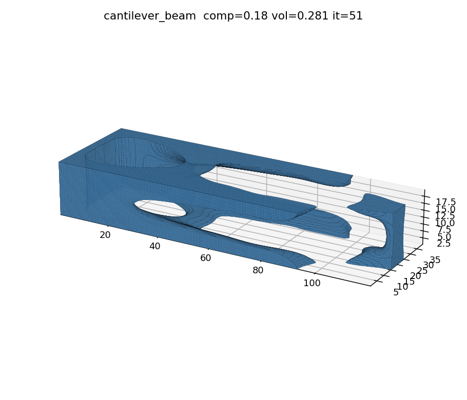
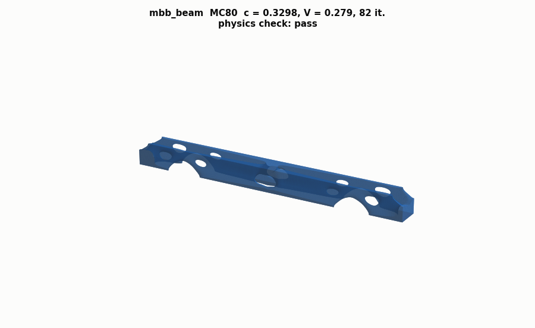
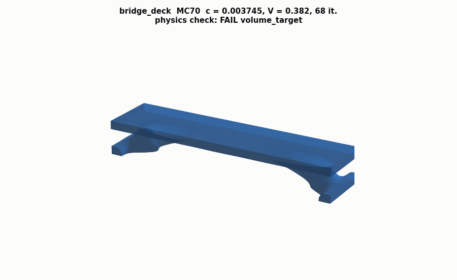
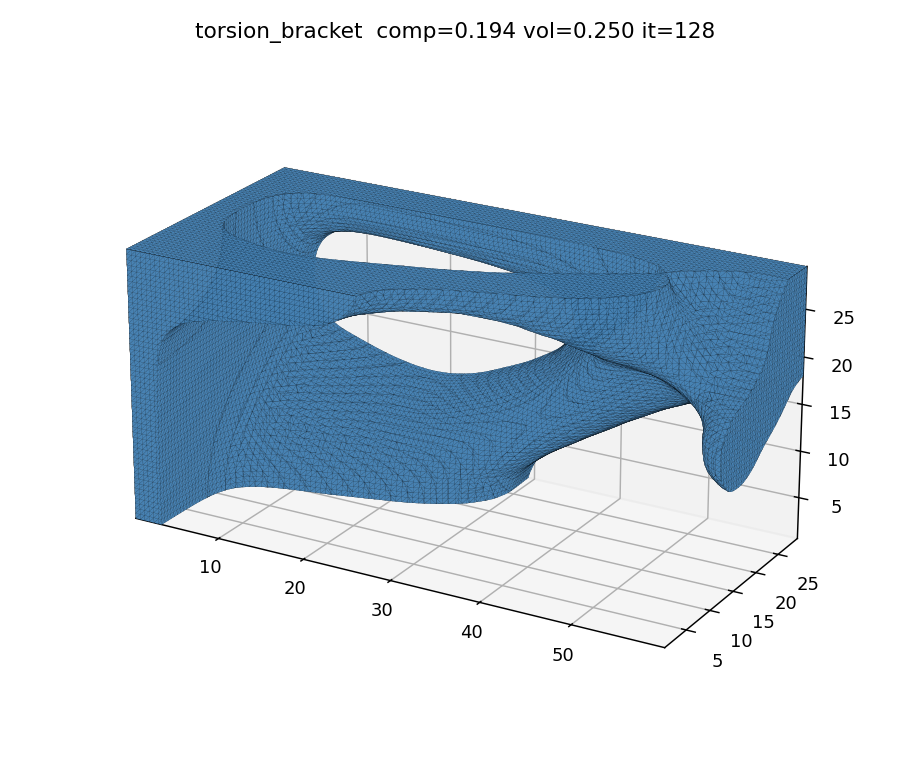
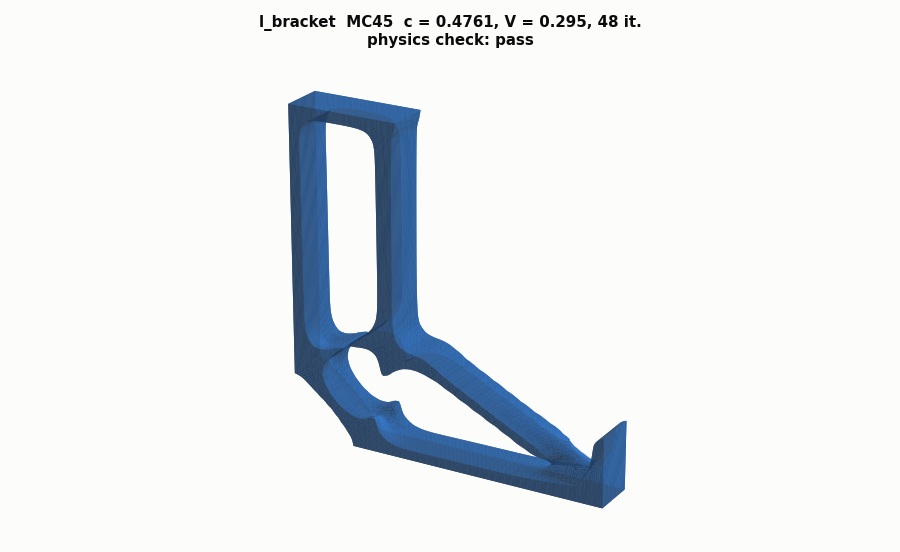
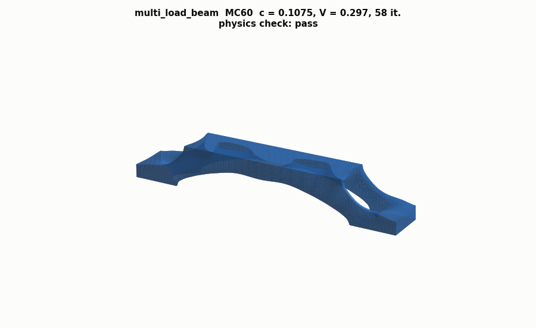

# Example catalogue

The four README/paper examples (`GE_bracket`, `air_bracket`, `hand`,
`quadcopter`, category `"paper"`) are documented in the top-level README.
This page catalogues the six additional **continuum** examples registered in
`freeto/examples.py`, whose geometry is generated by
`examples/make_examples.py` (via `freeto/geometry.py`) into
`examples/STLs/generated/`. All were run to convergence with the real core
(`python -m freeto.cli --example NAME --mesh MESH_CONTROL`), SIMP + OC, on
this machine; renders below are the raw optimized surface
(`FreeTOResult.surface()`), unsmoothed mesh triangles shown for clarity.

| name | category | mesh_control | grid (nelx×nely×nelz) | active/total elements | DOFs | load cases | iterations | runtime | final compliance | final vol. frac |
|---|---|---:|---|---:|---:|---:|---:|---:|---:|---:|
| `cantilever_beam` | beam | 50 | 49×16×8 | 6,272 / 6,272 | 22,950 | 1 | 51 | 10.7 s | 0.180 | 0.281 |
| `mbb_beam` | beam | 80 | 79×13×13 | 13,351 / 13,351 | 47,040 | 1 | 82 | 57.8 s* | 0.330 | 0.279 |
| `bridge_deck` | truss-like | 70 | 69×10×17 | 11,730 / 11,730 | 41,580 | 1 | 68 | 41.3 s* | 0.00375 | 0.382 |
| `torsion_bracket` | advanced | 28 | 27×13×13 | 4,563 / 4,563 | 16,464 | 2 | 128 | 23.5 s | 0.194 | 0.250 |
| `l_bracket` | advanced | 45 | 44×44×6 | 6,570 / 11,616 | 42,525 | 1 | 48 | 11.5 s* | 0.476 | 0.295 |
| `multi_load_beam` | advanced | 60 | 59×9×9 | 4,779 / 4,779 | 18,000 | 3 | 58 | 10.1 s* | 0.107 | 0.297 |

(Runtimes measured single-threaded on the machine used to build this
package, with the `pardiso` direct solver; they'll vary with hardware but all
six stay under the ~60 s target on a laptop.) Rows marked * were re-run on
2026-10-02 after the region corrections below (single-threaded, while a second
job used the other core); `cantilever_beam` and `torsion_bracket` are
unchanged. Every row's design passes the physics check of `freeto.audit`
(one grounded component, all loads on it) except `bridge_deck`, whose OC
volume is 0.382 against `volfrac = 0.35` ("volume off target": FreeTO's
volume constraint acts on the filtered field before the kept deck is set to 1,
so a large keep region overshoots the target; it is not a connectivity
defect).

## Corrections of 2026-10-02

The physics audit (`docs/PHYSICS_AUDIT.md` §2) found two setup defects that
hit every optimizer alike; a check of all six generated examples at
mesh_control 20–100 found two more. Region slabs are now sized from the exact
FreeTO grid (`_capture` in `examples/make_examples.py`): each reaches the
outermost element-centre layer (and so the outermost node layer) at every
mesh_control from 24 to 100. Loads and supports stay where they were; only
the slab depths changed. `freeto/core.py` now also logs a WARNING when a kept
region holds no element centre, when keep elements lie outside the domain, or
when the keep regions exceed `volfrac`. `tests/test_audit.py` checks the
regions at MC 24, 30, 36 (all examples) and MC 24, 31, 41, 70 (bridge).

| example | defect | correction |
|---|---|---|
| `bridge_deck` | the deck slab (`keepdom` + load) started at y = 25.65 mm and the support pads ended at y = 4 mm, so at MC 24, 25, 30, 31 no element centre lay in either: nothing was kept (MusD = 0) | deck slab y ≥ 22.59 mm (7.41 mm deep: one element row at MC 24–47, two or three at finer meshes); pads y ≤ 7.61 mm, still 8.7 mm long at both bottom ends. The kept row is 17–33 % of the domain, so **`volfrac` 0.2 → 0.35** (0.2 would be infeasible). At MC 24–27 (3 element rows) the deck alone is 36 % and the core warns that the volume target cannot be met |
| `l_bracket` | the support slab spanned the whole top face of the bounding box (x = 0–100 mm), so the elements above the notch (x > 35 mm) were keep elements outside the domain (76 at MC 30), written as solid into the returned field | slab clipped to the vertical arm, x ≤ 35 mm (the outward margin is kept only beyond the outer faces) |
| `mbb_beam` | the load patch (y ≥ 22 mm) held no element centre at MC 20–41 except 31, so the loaded material was not kept | patch y ≥ 18.72 mm, x ≥ 146.38 mm |
| `multi_load_beam` | support pads (y ≤ 4 mm) and load patches (y ≥ 16.95 mm) held no element centre at MC 24, 28, 30, 36 | pads y ≤ 5.09 mm, patches y ≥ 14.91 mm |

All configs use `E = 210 GPa`, `poisson_ratio = 0.3` (default), `method =
"SIMP"`, `optimizer = "OC"` (FreeTO's defaults) unless noted.

## cantilever_beam

120×40×20 mm cantilever, fixed at the `x = 0` face, a downward (`-y`) point
load on a small patch at the free-end tip, mid-height. `volfrac = 0.3`.

Classic expected topology: two top/bottom flanges (bending-resisting chords)
joined by a diagonal web running from the support to the load point — the
textbook Michell-type cantilever result. The render below shows exactly
that: a lens-shaped void opens up near the fixed end and a second, narrower
void appears further along, leaving two solid flange-like bands connected by
diagonal material.



## mbb_beam

Half of the classic MBB (messerschmitt–bölkow–blohm) beam, domain
150×25×25 mm. A roller (y-fixed) support near the bottom of the far end
(`x = 0`), the `x = max` face is the symmetry plane (x-fixed, matching
`apply_symmetry("y-z", "right")`'s mirror-about-x-max convention) with the
downward point load applied at its top, plus a single small z-fixed patch at
one corner purely to remove the last (depth-translation) rigid-body mode.
Mirrored about the symmetry plane after optimization to give the full
300 mm beam. `volfrac = 0.3`.

Classic expected topology: a truss-like lattice of diagonal struts between
the support and the load (the standard 2D MBB result extruded/thickened into
3D). The render shows lens-shaped voids opening on both faces, leaving a
diagonal strut pattern that mirrors correctly across the full 300 mm span.



## bridge_deck

200×30×50 mm bridge span, fixed at both bottom ends (full width), with a
distributed downward load over the top deck slab; the same slab is also
passed as `keepdom` so it stays a continuous solid surface (the "road
deck") while the material below it is free to optimize. The slab is 7.41 mm
deep so that it holds the top element row at every mesh_control ≥ 24 (it was
4.35 mm and held nothing at MC 24–31, see the corrections above).
`volfrac = 0.35` (was 0.2; the kept deck row alone is 17–33 % of the
domain).

Classic expected topology: an arch/truss-like structure below the deck
carrying load down to the two end supports. With the deck kept and 35 %
volume, the render shows the solid flat deck carried by curved, splayed legs
that run from each end pad up into the deck, leaving the span between them
open.



## torsion_bracket

60×30×30 mm bracket, fixed at the `x = 0` face, with **two load cases**:

1. a centred downward (`-y`) bending load at the free end;
2. an off-axis (lever-arm) load at a corner of the free end, offset from
   the section centroid on both the y and z axes, pushing `+z` — since the
   line of action doesn't pass through the shear centre, a single
   transverse force there produces a genuine torque about the bracket's
   long (x) axis in addition to secondary bending (FreeTO's force model
   applies one uniform force per region, so a true two-patch opposite-force
   *couple* isn't directly expressible — see `freeto/examples.py`'s
   docstring — this off-axis single-patch load is the closest realistic
   equivalent that still produces genuine torque).

`volfrac = 0.25`.

Classic expected topology: cross-sections evolve toward closed, tube-like
shapes (good torsional stiffness needs a closed load path around the axis,
unlike open flanges which resist bending better). The render shows a
twisted ribbon-like solid with two elongated, diagonally-oriented voids —
consistent with a design balancing the centred bending case against the
off-axis torsional case.



## l_bracket

Classic L-shaped bracket, 100×100×15 mm: a 100×100 mm outer square with a
65×65 mm corner notch removed (`freeto.geometry.l_shape`), giving ~57% of
the bounding box as active material. Fixed at the top of the vertical arm
(the support slab covers only the arm, x ≤ 35 mm; before 2026-10-02 it
covered the whole bounding-box face and kept elements over the notch),
a 1000 N downward point load at the tip of the horizontal arm. `volfrac =
0.3`.

Classic expected topology: material concentrates along the two arms, with
a diagonal strut bridging the concave (re-entrant) corner to relieve its
stress concentration — the textbook L-bracket result. The render shows
this: a frame along both arms with a diagonal brace from the inner corner to
the load tip.



## multi_load_beam

Simply supported 3D beam, 120×20×20 mm, fixed at both bottom ends, with
**three load cases** — a downward point load at `x = 30`, `x = 60`, and
`x = 90` mm along the top, one per case (a robust design against load-
position uncertainty; FreeTO sums the compliance of all load cases in the
same optimization). `volfrac = 0.3`.

Classic expected topology: a denser, more truss-like/webbed lattice than a
single-load-case beam of the same span, since the design must perform
reasonably under each load independently rather than being specialized for
one location. The render shows exactly that: four lens-shaped voids strung
along the span (one per load plus a shared one), leaving a truss-like top
chord and a curved bottom chord connected by diagonal webs.



## Regenerating

```bash
python examples/make_examples.py     # rebuilds examples/STLs/generated/*.stl
python -m freeto.cli --example cantilever_beam --mesh 50 --out cantilever.stl
```

`tests/test_examples.py` validates every one of these configs (cheap: reads
the STLs and builds the grid, no solve), checks each generated STL is
watertight, and runs two of them (`cantilever_beam`, `l_bracket`) for 3
iterations as a smoke test of the full `run_freeto` path.
